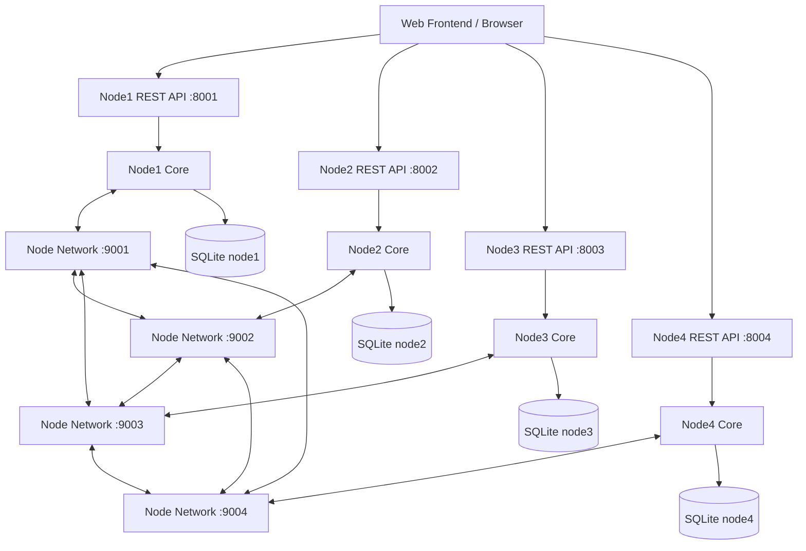

# 系统架构设计

## 总体架构

系统由 4 个本地节点组成。每个节点包含 REST API、P2P API、节点核心、交易池、共识模块、执行器、Merkle/SMT 模块和 SQLite 存储。REST API 面向浏览器或演示脚本，P2P API 面向节点间共识和交易广播。

## 节点内部模块

- API Server：解析 HTTP 请求，统一响应格式，执行输入校验。
- P2P Server：接收共识消息、交易广播、状态查询和区块同步请求。
- UserManager：注册、登录、session 管理、用户索引。
- Mempool：维护待共识交易顺序和 tx_id 索引。
- Executor：验证并执行交易，生成账户变更和 state root。
- MerkleTree：为区块交易生成 root 和 proof。
- SparseMerkleTree：为账户状态生成 root 和状态 proof。
- ConsensusEngine：实现 PRE_PREPARE、PREPARE、COMMIT、view change 和攻击模式。
- Storage：SQLite 建表、事务、查询。

## 部署端口

| 节点 | REST | P2P | 数据库 |
| --- | --- | --- | --- |
| node1 | 8001 | 9001 | data/node1/chain.db |
| node2 | 8002 | 9002 | data/node2/chain.db |
| node3 | 8003 | 9003 | data/node3/chain.db |
| node4 | 8004 | 9004 | data/node4/chain.db |

## 数据流

1. 客户端向 REST API 提交注册、登录或交易。
2. 节点验证交易签名和 nonce，将交易写入本地 mempool 并广播。
3. master primary 按高度提取 mempool 交易，生成候选区块。
4. 诚实节点独立计算 tx_merkle_root 和 state_root。
5. 达到 PREPARE 和 COMMIT quorum 后提交区块。
6. 提交时事务写入 blocks、transactions、accounts、smt_nodes、state_roots。
